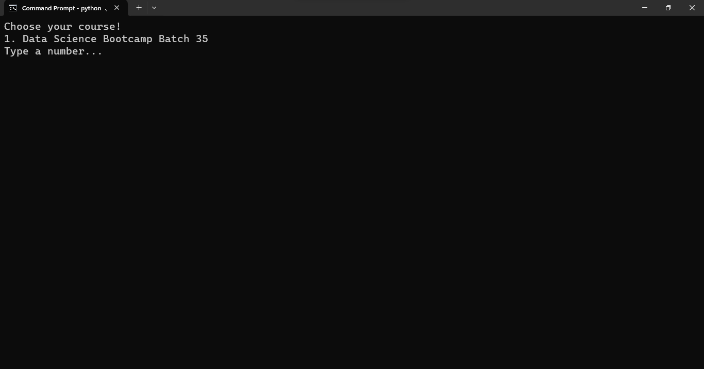

# Rakamin Attendance Recap Assistant

> Repository ini dijadikan sebagai project sampingan dan untuk mempermudah Class Coordinator lain yang mungkin saja melihat repository ini
>
> Project ini dibuat 100% tangan sendiri, segala kekurangan hadirnya dari saya pribadi. Jangan lupa untuk kasih credit, jikalau ada sesuatu apapun itu bisa dibicarakan langsung dengan saya. Thank you~

## Backstory
Setelah mencoba untuk mendaftar dari Bulan Maret, pada Juni 2023 akhirnya aku diterima sebagai Awardee Scholarship Data Science Bootcamp Rakamin. Sebagai Awardee kami diberikan mandat untuk menjadi Class Coordinator.

Menjadi Class Coordinator tentunya memiliki tanggungjawab dan tugas yang perlu dipenuhi dan salah satunya adalah merekap kehadiran siswa. Hal ini menjadi concern pertama ku karena ternyata tugas yang bersifat repetitif ini dilakukan secara manual.

Pada evaluasi bulanan pertama, hal ini langsung aku sampaikan. Aku memberikan saran agar hal yang bersifat repetitif seperti ini dapat dibuat automasi nya. Bulan Juli berlalu, namun sistem tersebut tidak kunjung diimplementasikan. Pada bulan Agustus 2023, akhirnya aku membuat script ku sendiri untuk mempermudah diriku dan tentunya menghemat tenaga serta waktu. Script ini masih aku pakai sampai sekarang (19 Desember 2023)

## Prerequisites
Untuk memakai automasi ini, yang perlu disiapkan adalah
1. [Python](https://www.python.org/downloads/) 
   Library pendukung:
   1. [pandas](https://pypi.org/project/pandas/)
   2. [keyring](https://pypi.org/project/keyring/)
   3. [requests](https://pypi.org/project/requests/)
2. [Git](https://git-scm.com/downloads) (optional)

Note:
1. Seharusnya tidak ada masalah mengenai versi
2. Bekerja dengan baik di sistem operasi Windows 11
3. Mungkin tidak akan bekerja di sistem operasi selain Windows
4. Kalau ada masalah, bisa kontak aku atau buat issue baru via github

## Steps
1. Clone/Download lalu extract Repository ini

   

2. Pastikan 3 files ini ada di dalam folder yang sama:
   1. `participants.csv`, bisa didapatkan lewat zoom
      1. Buka my account di zoom
      2. Buka bagian [Reports](https://zoom.us/account/my/report#/)
      3. Pilih tanggal live session (jika bukan hari ini)
      4. Klik di bagian angka di kolom Participants

      

      6. Klik export, nanti akan terdownload dan rename menjadi `participants.csv`
      
      
   
   2. permit.csv, berisi data perizinan siswa
   
      
   
      Kalau tidak ada yang izin, bisa dibiarkan kosong saja

      
   
   3. students.csv, berisi data siswa keseluruhan

      

3. Buka CMD di folder yang sama

   

4. Ketik `python ./automation.py`, lalu tekan enter

   

5. Login 
   Pada saat pertama kali maka akan diminta untuk login terlebih dahulu. Kredensial ini nantinya bisa dipakai lagi dalam bentuk token. Token ini juga bisa kadaluarsa pada kurun waktu tertentu.

   

   Apabila berhasil, maka akan ditanya apakah ingin menyimpan token tersebut atau tidak. Apabila tidak (n), maka pada saat menjalan script ini di kemudian hari akan diminta untuk login kembali. Apabila iya (y), maka pada saat menjalankan script ini di kemudian hari akan mencoba untuk menggunakan token yang sudah tersimpan, namun jika sudah kadaluarsa akan diminta untuk login kembali lagi.

   

6. Pilih course

   

   Contoh: 1 
   lalu `enter`
7. Pilih live session yang sesuai dengan daftar hadir 

   

   Contoh: 3 
   lalu `enter`
8. Let the script does his job 
   Script nya akan mengecek terlebih dahulu apakah semua data student sudah ada di LMS atau belum. Jika belum, maka script akan berhenti. Aku tidak tau kenapa dan mengapa tapi data pada LMS biasanya akan lengkap dalam waktu sehari setelah live session.